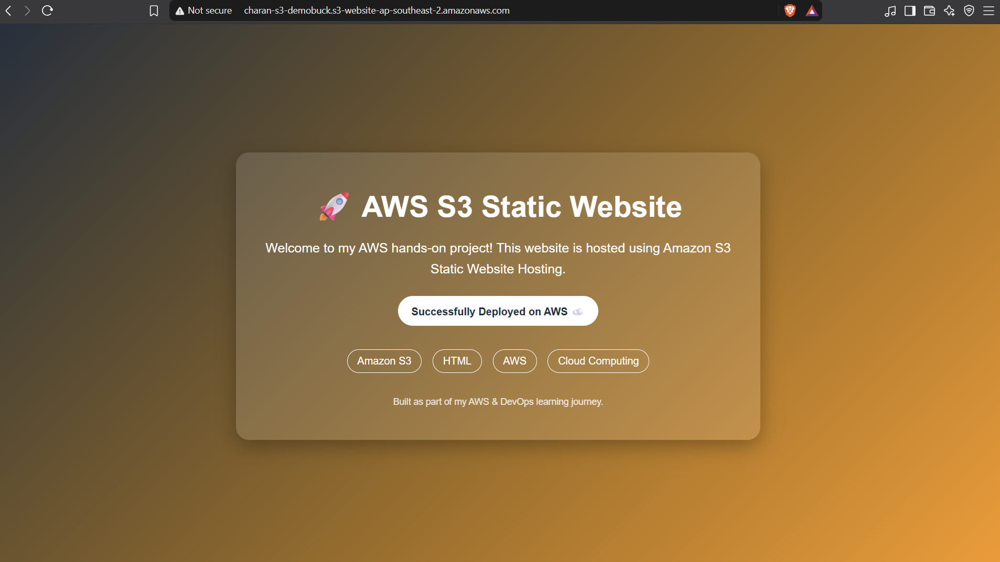

# AWS S3 Static Website Hosting

## 📌 Project Overview

This project demonstrates how to host a static website using **Amazon S3 Static Website Hosting**.

The website is created using HTML and deployed to an S3 bucket. Public access is configured using an S3 bucket policy, allowing the website to be accessed through the S3 static website endpoint.

## 🛠️ AWS Services Used

- Amazon S3
- S3 Static Website Hosting
- S3 Bucket Policy
- S3 Versioning

## 🚀 Implementation Steps

1. Created an S3 bucket.
2. Uploaded `index.html` to the bucket.
3. Enabled **S3 Static Website Hosting**.
4. Configured `index.html` as the index document.
5. Disabled **Block Public Access** for this demo.
6. Added an S3 bucket policy to allow public read access to the website objects.
7. Enabled **S3 Versioning** to maintain different versions of objects.
8. Accessed the website using the S3 static website endpoint.

## 📂 Project Files

| File | Description |
|---|---|
| `01-index.html` | HTML source code for the static website |
| `02-bucket-policy.json` | S3 bucket policy used for public read access |
| `03-static-website-output.png` | Screenshot showing the deployed website |

## 🌐 Website Output

The website was successfully deployed using Amazon S3 Static Website Hosting.

## 🔐 Security Note

For this learning project, public access was enabled to demonstrate S3 static website hosting.

For production applications, a more secure architecture such as **Amazon CloudFront with appropriate access controls** should be considered instead of making the S3 bucket publicly readable.

## 🎯 What I Learned

- Creating and configuring an S3 bucket
- Uploading objects to S3
- Enabling static website hosting
- Configuring S3 bucket policies
- Understanding S3 public access settings
- Enabling S3 Versioning
- Hosting a static website on AWS
