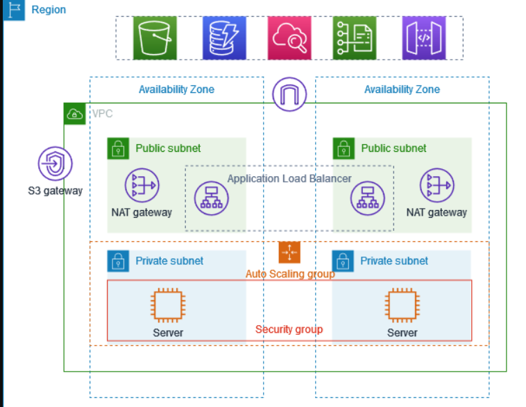
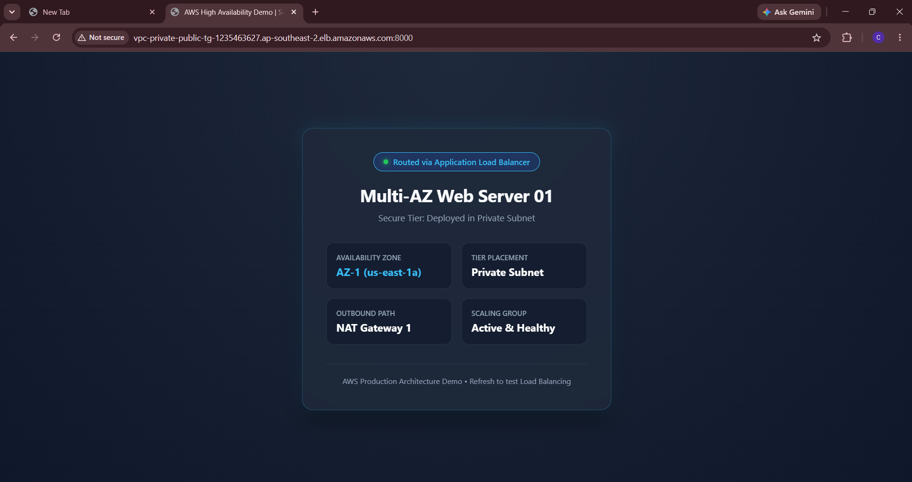
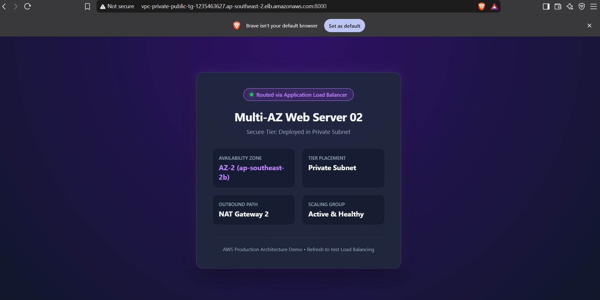

# AWS Multi-AZ High-Availability VPC Architecture with ALB

A production-grade, highly available, and secure multi-tier infrastructure deployed on Amazon Web Services (AWS). This architecture isolates compute workloads in private subnets across multiple Availability Zones (AZs) while leveraging an internet-facing Application Load Balancer (ALB) to evenly distribute incoming user traffic.

---

## 🏗️ Architecture Overview



* **VPC Configuration**: Custom VPC spanning 2 Availability Zones (`ap-southeast-2a` and `ap-southeast-2b`) for high fault tolerance.
* **Public Tier**:
  * 2 Public Subnets housing the internet-facing **Application Load Balancer (ALB)** and an **SSH Bastion Host**.
  * Connected to an **Internet Gateway (IGW)** for inbound and outbound public internet access.
* **Private Tier**:
  * 2 Private Subnets containing backend EC2 instances hosting the demo application.
  * Compute nodes have **zero public IP addresses**, preventing unauthorized ingress.
* **Secure Egress**:
  * Dedicated **NAT Gateways** configured in public subnets across both AZs to allow backend instances to pull operating system updates and patches securely.
* **Security Group Layering**:
  * ALB Security Group accepts HTTP traffic on port `8000`.
  * Private EC2 Security Groups allow inbound traffic on port `8000` **only** from the ALB Security Group, eliminating direct network exposure.

---

## ⚙️ Component Details

| Component | Resource / Port | Placement | Function |
| :--- | :--- | :--- | :--- |
| **VPC** | `10.0.0.0/16` | Multi-AZ | Isolated software-defined network boundary |
| **Public Subnets** | Subnet A & Subnet B | Public AZ-1 / AZ-2 | Houses ALB nodes and NAT Gateways |
| **Private Subnets** | Subnet A & Subnet B | Private AZ-1 / AZ-2 | Houses isolated compute workloads |
| **ALB** | `HTTP:8000` | Public Subnets | Routes traffic across registered healthy target instances |
| **Bastion Host** | `SSH:22` | Public Subnet | Secure administrative jump box to manage private instances |
| **EC2 Server 01** | `Port 8000` | Private Subnet (AZ-1) | Serves Blue UI template |
| **EC2 Server 02** | `Port 8000` | Private Subnet (AZ-2) | Serves Purple UI template |

---

## 🚀 Hands-on Verification & Testing

### 1. Application Load Balancing (UI Verification)

Requests hitting the Load Balancer DNS are dynamically distributed between Server 01 and Server 02 in round-robin fashion:

| Server 01 (AZ-1 - Blue) | Server 02 (AZ-2 - Purple) |
| :---: | :---: |
|  |  |

---

### 2. Traffic Distribution Test (CLI Proof)

Automated bash `curl` loop executed via the Bastion host confirms load balancing across both Availability Zones:

```bash
for i in {1..8}; do 
  curl -s [http://vpc-private-public-tg-1235463627.ap-southeast-2.elb.amazonaws.com:8000](http://vpc-private-public-tg-1235463627.ap-southeast-2.elb.amazonaws.com:8000) | grep -o "Multi-AZ Web Server 0[12]"
  sleep 0.5
done


## 🛠️ Deployment Steps Summary

### 1. Networking & VPC Setup
* **Custom VPC:** Created a custom VPC with a `10.0.0.0/16` CIDR block spanning two Availability Zones (`ap-southeast-2a` and `ap-southeast-2b`).
* **Subnet Segmentation:** Provisioned four total subnets:
  * 2 Public Subnets (for the Application Load Balancer and Bastion Host).
  * 2 Private Subnets (for backend compute instances).
* **Internet Gateway (IGW):** Attached an IGW to the VPC and updated the public route table (`0.0.0.0/0 -> igw-xxxx`) to enable inbound/outbound internet routing.
* **NAT Gateways:** Allocated Elastic IPs and deployed NAT Gateways in each public subnet, updating private route tables (`0.0.0.0/0 -> nat-xxxx`) to allow secure outbound-only traffic for backend nodes.

---

### 2. Security Group Configuration
* **ALB Security Group (`alb-sg`):**
  * Inbound: Allowed Custom TCP on port `8000` from anywhere (`0.0.0.0/0`).
  * Outbound: Default allow all traffic to backend instances.
* **EC2 Web Server Security Group (`web-sg`):**
  * Inbound: Allowed Custom TCP on port `8000` restricted exclusively to `alb-sg`.
  * Inbound: Allowed SSH on port `22` restricted exclusively to the Bastion host security group.
* **Bastion Security Group (`bastion-sg`):**
  * Inbound: Allowed SSH on port `22` from administrator IP.

---

### 3. Compute Provisioning & Application Deployment
* **Bastion Host:** Launched an EC2 instance in a public subnet with an auto-assigned public IP for administrative jump-box access.
* **Backend EC2 Web Servers:** Launched two private Ubuntu EC2 instances across both AZs (`10.0.154.168` and `10.0.129.128`) without public IPs.
* **Workload Configuration:**
  * Connected via SSH to the Bastion host and jumped into each private instance using the `.pem` key.
  * Deployed `index.html` on Server 01 (Blue UI) and Server 02 (Purple UI).
  * Started persistent web services on port `8000`:
    ```bash
    nohup python3 -m http.server 8000 > server.log 2>&1 &
    ```

---

### 4. Load Balancing Configuration
* **Target Group (`private-public-loadtemp`):**
  * Configured target type as **Instances** with protocol **HTTP:8000**.
  * Registered private instances `10.0.154.168` and `10.0.129.128`.
  * Set health check path to `/` on port `8000`.
* **Application Load Balancer (`vpc-private-public-tg`):**
  * Created as **Internet-facing** distributed across the two public subnets.
  * Added an HTTP listener on port `8000` forwarding traffic to `private-public-loadtemp`.

---

### 5. Verification & High-Availability Validation
* **Target Group Health:** Monitored health checks until both backend targets transitioned to a green **Healthy** state.
* **CLI Round-Robin Test:** Ran an automated bash `curl` loop from the Bastion host to verify that requests routed sequentially between Availability Zones:
  ```bash
  for i in {1..8}; do curl -s [http://vpc-private-public-tg-1235463627.ap-southeast-2.elb.amazonaws.com:8000](http://vpc-private-public-tg-1235463627.ap-southeast-2.elb.amazonaws.com:8000) | grep -o "Multi-AZ Web Server 0[12]"; sleep 0.5; done
